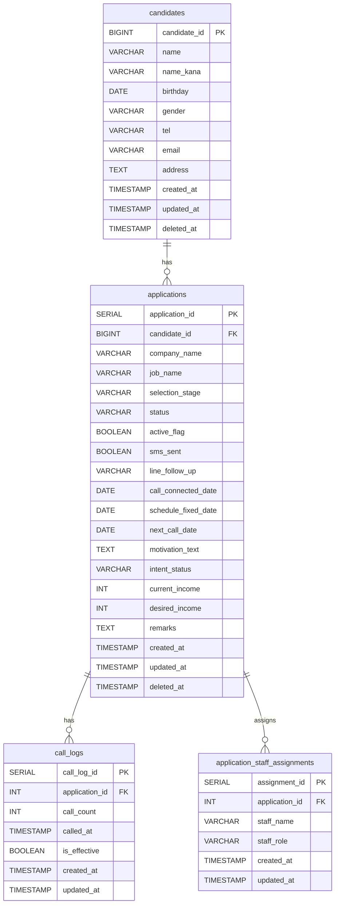
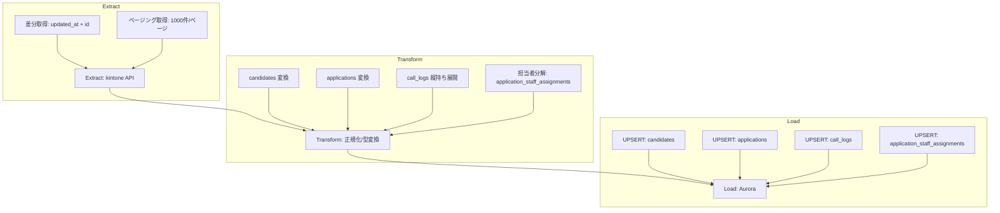

# kintone -> Aurora データベース設計書

## 目的と前提

- kintoneのデータをAuroraに正規化し、分析・検索をしやすくする
- 小さな変更で致命的な欠陥を解消し、実装可能な制約/型を明確化する
- 命名規則は `lower_snake_case`、テーブル名は複数形で統一する

## ER 図

## テーブル定義

### candidates (求職者マスタ)

目的/役割:
求職者の基本情報を保持する。kintoneの「求職者コード」を主キーとして同期する。

制約と方針:
- PK: `candidate_id`
- NOT NULL: `candidate_id`, `name`, `created_at`, `updated_at`
- DEFAULT: `created_at`/`updated_at` は `CURRENT_TIMESTAMP`
- 論理削除: `deleted_at` を利用し、`deleted_at IS NULL` を通常検索条件とする
- 参照整合性: `applications.candidate_id` が参照

インデックス:
- `idx_candidates_email` (`email`)
- `idx_candidates_tel` (`tel`)
- `idx_candidates_updated_at` (`updated_at`)

| カラム名 | データ型 | kintone項目名 | 制約/DEFAULT | 備考 |
| --- | --- | --- | --- | --- |
| candidate_id | BIGINT | 求職者コード | PK, NOT NULL | kintone側IDと一致させる |
| name | VARCHAR(255) | 求職者名 | NOT NULL | PII |
| name_kana | VARCHAR(255) | 求職者名（カタカナ） |  | PII |
| birthday | DATE | 生年月日 |  | PII |
| gender | VARCHAR(10) | 性別 | CHECK (`gender` IN ('male','female','other','unknown')) | 値は運用で調整 |
| tel | VARCHAR(20) | 電話番号 |  | PII |
| email | VARCHAR(255) | メールアドレス |  | PII |
| address | TEXT | 現住所 |  | PII |
| created_at | TIMESTAMP | 登録日 | NOT NULL, DEFAULT CURRENT_TIMESTAMP | 監査/ETL差分 |
| updated_at | TIMESTAMP | 更新日時 | NOT NULL, DEFAULT CURRENT_TIMESTAMP | 監査/ETL差分 |
| deleted_at | TIMESTAMP | - |  | 論理削除日時 |

### applications (選考・案件管理)

目的/役割:
求職者ごとの応募/選考状況を保持する。分析では候補者の時系列推移を追う起点となる。

制約と方針:
- PK: `application_id`
- FK: `candidate_id` -> `candidates.candidate_id`
- NOT NULL: `application_id`, `candidate_id`, `created_at`, `updated_at`
- DEFAULT: `active_flag`/`sms_sent` は `FALSE`、`created_at`/`updated_at` は `CURRENT_TIMESTAMP`
- 参照整合性: `ON DELETE RESTRICT`, `ON UPDATE CASCADE`
- 列挙値: `selection_stage`, `status`, `intent_status` は CHECK で代表値を定義

インデックス:
- `idx_applications_candidate_id` (`candidate_id`)
- `idx_applications_status` (`status`)
- `idx_applications_selection_stage` (`selection_stage`)
- `idx_applications_next_call_date` (`next_call_date`)
- `idx_applications_updated_at` (`updated_at`)

| カラム名 | データ型 | kintone項目名 | 制約/DEFAULT | 備考 |
| --- | --- | --- | --- | --- |
| application_id | SERIAL | - | PK, NOT NULL | 内部管理ID |
| candidate_id | BIGINT | 求職者コード | FK, NOT NULL | `candidates.candidate_id` 参照 |
| company_name | VARCHAR(255) | 応募企業名 |  | 文字列で保持（将来マスタ化候補） |
| job_name | VARCHAR(255) | 応募求人名 |  | 文字列で保持（将来マスタ化候補） |
| selection_stage | VARCHAR(50) | 応募段階 | CHECK (`selection_stage` IN ('entry','screening','interview','offer','hired','rejected','withdrawn')) | 値は運用で調整 |
| status | VARCHAR(50) | ステータス | CHECK (`status` IN ('open','in_progress','closed','on_hold')) | 値は運用で調整 |
| active_flag | BOOLEAN | アクティブ | NOT NULL, DEFAULT FALSE |  |
| sms_sent | BOOLEAN | SMS送信 | NOT NULL, DEFAULT FALSE |  |
| line_follow_up | VARCHAR(100) | LINE追客 |  | 例: 'none','sent','replied' |
| call_connected_date | DATE | 通電日 |  |  |
| schedule_fixed_date | DATE | 日程確定日 |  |  |
| next_call_date | DATE | 新規発信予定日 |  |  |
| motivation_text | TEXT | 動機文 |  |  |
| intent_status | VARCHAR(50) | 意欲ステータス | CHECK (`intent_status` IN ('high','medium','low','unknown')) | 値は運用で調整 |
| current_income | INT | 年収（現） | CHECK (`current_income` >= 0) |  |
| desired_income | INT | 年収（希望） | CHECK (`desired_income` >= 0) |  |
| remarks | TEXT | 備考 |  |  |
| created_at | TIMESTAMP | - | NOT NULL, DEFAULT CURRENT_TIMESTAMP | 監査/ETL差分 |
| updated_at | TIMESTAMP | - | NOT NULL, DEFAULT CURRENT_TIMESTAMP | 監査/ETL差分 |
| deleted_at | TIMESTAMP | - |  | 論理削除日時 |

FK 方針:
- `applications.candidate_id` -> `candidates.candidate_id`
- `ON DELETE RESTRICT`（誤削除防止）
- `ON UPDATE CASCADE`（kintone側ID変更に追随）

### call_logs (架電履歴)

目的/役割:
応募に対する架電履歴を時系列で保持し、通電・有効応募の分析に使う。

制約と方針:
- PK: `call_log_id`
- FK: `application_id` -> `applications.application_id`
- NOT NULL: `application_id`, `call_count`, `called_at`, `created_at`, `updated_at`
- UNIQUE: (`application_id`, `call_count`) で同一応募の架電回数重複を防止
- 参照整合性: `ON DELETE CASCADE`, `ON UPDATE CASCADE`

インデックス:
- `idx_call_logs_application_id` (`application_id`)
- `idx_call_logs_called_at` (`called_at`)

| カラム名 | データ型 | kintone項目名 | 制約/DEFAULT | 備考 |
| --- | --- | --- | --- | --- |
| call_log_id | SERIAL | - | PK, NOT NULL |  |
| application_id | INT | - | FK, NOT NULL | `applications.application_id` 参照 |
| call_count | INT | - | NOT NULL, CHECK (`call_count` >= 1) | 何回目の架電か |
| called_at | TIMESTAMP | ◯回目架電 | NOT NULL | 架電日時 |
| is_effective | BOOLEAN | 有効応募/通電 | NOT NULL, DEFAULT FALSE |  |
| created_at | TIMESTAMP | - | NOT NULL, DEFAULT CURRENT_TIMESTAMP | 監査/ETL差分 |
| updated_at | TIMESTAMP | - | NOT NULL, DEFAULT CURRENT_TIMESTAMP | 監査/ETL差分 |

FK 方針:
- `call_logs.application_id` -> `applications.application_id`
- `ON DELETE CASCADE`（応募削除時に架電も削除）
- `ON UPDATE CASCADE`

### application_staff_assignments (担当者紐付け)

目的/役割:
応募と担当者の紐付けを保持する。担当者の変更履歴を残すために分離する。

制約と方針:
- PK: `assignment_id`
- FK: `application_id` -> `applications.application_id`
- NOT NULL: `application_id`, `staff_name`, `staff_role`, `created_at`, `updated_at`
- 参照整合性: `ON DELETE CASCADE`, `ON UPDATE CASCADE`

インデックス:
- `idx_assignments_application_id` (`application_id`)
- `idx_assignments_staff_name` (`staff_name`)

| カラム名 | データ型 | 制約/DEFAULT | 備考 |
| --- | --- | --- | --- |
| assignment_id | SERIAL | PK, NOT NULL |  |
| application_id | INT | FK, NOT NULL | `applications.application_id` 参照 |
| staff_name | VARCHAR(255) | NOT NULL | 担当者名（将来マスタ化候補） |
| staff_role | VARCHAR(50) | NOT NULL, CHECK (`staff_role` IN ('cs','partner','other')) | 値は運用で調整 |
| created_at | TIMESTAMP | NOT NULL, DEFAULT CURRENT_TIMESTAMP | 監査/ETL差分 |
| updated_at | TIMESTAMP | NOT NULL, DEFAULT CURRENT_TIMESTAMP | 監査/ETL差分 |

FK 方針:
- `application_staff_assignments.application_id` -> `applications.application_id`
- `ON DELETE CASCADE`
- `ON UPDATE CASCADE`

## ETL 設計

ETL 補足:
- UPSERTキー: `candidates.candidate_id`, `applications.application_id`, `call_logs.call_log_id`, `application_staff_assignments.assignment_id`
- `updated_at` を差分取得の主キーに使用し、`deleted_at` の反映も同期対象とする
- 文字列の列挙値は変換時に正規化する（未知値は `unknown` に寄せるなど）

## セキュリティ/コンプライアンス

PII取り扱い:
- 対象: `name`, `name_kana`, `birthday`, `tel`, `email`, `address`
- 最小化: 分析に不要な列はAuroraへ同期しない選択肢を用意
- 暗号化: Auroraのストレージ暗号化に加え、`tel`/`email`/`address` はアプリ層でフィールド暗号化を検討
- マスキング: BIやログ出力時は `tel`/`email` を部分マスク（例: `***@example.com`）
- アクセス制御: DBロールで `SELECT` 権限を分離（PII閲覧ロールと分析ロールを分ける）

論理削除:
- 通常の検索は `deleted_at IS NULL` を必須条件とする
- 削除要求（本人削除）の場合は、`deleted_at` 付与 + PIIの匿名化/マスキングを検討
- 保存期間ポリシーに従い、期限到達後は物理削除またはアーカイブを実施

ログ/監査:
- `call_logs` は監査性が高いため、保存期間を明記（例: 2年保持）
- 長期保管が必要な場合は別スキーマ/アーカイブテーブルへ移送
- 監査目的で `created_at`/`updated_at` を全テーブルに維持

## 用語集

- PK: 主キー。テーブル内で一意に行を識別する列
- FK: 外部キー。別テーブルのPKを参照して整合性を保つ列
- UNIQUE: 重複を許さない制約
- NULL: 値が未設定であること
- BOOLEAN: 真偽値（TRUE/FALSE）
- 正規化: 重複や更新不整合を減らすためにテーブルを分割する設計
- 論理削除: 行を物理削除せず `deleted_at` などで削除状態を示す方式
- UPSERT: 既存行があれば更新、なければ挿入する処理
- インデックス: 検索を高速化するための補助構造
- 参照整合性: FKにより不正な参照を防ぐ仕組み

## 設計のポイント

- 正規化: `call_logs` と `application_staff_assignments` を分離し分析性を向上
- 列挙値: `selection_stage`/`status`/`intent_status` はCHECK制約で値を固定
- 監査: 全テーブルに `created_at`/`updated_at` を保持し、ETL差分取得に利用
- PII: マスキング/暗号化/権限分離を前提に設計
