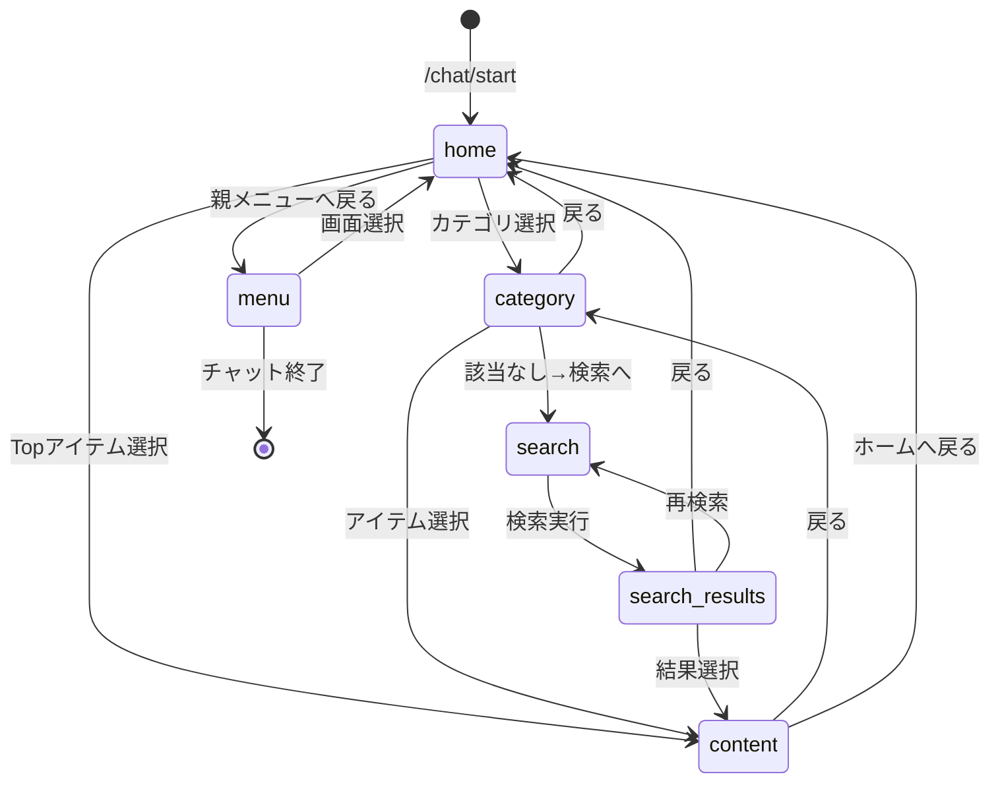

# B) 状態遷移設計

## 概要

チャットボットの状態（state）管理と遷移ルールを定義する。

---

## 1. state_id 規約

### 形式

```
{type}:{identifier}
```

### タイプ一覧

| type | 説明 | 例 |
|------|------|-----|
| home | 画面ホーム状態 | `home:yield_personal` |
| menu | 親メニュー状態 | `menu:watarimari` |
| category | カテゴリ選択状態 | `category:faq:yield_personal` |
| content | コンテンツ表示状態 | `content:item_001` |
| search | 検索状態 | `search:active` |

### 完全な state_id パターン

```
home:{screen_id}              # 画面トップ
menu:{menu_name}              # 親メニュー
category:{cat_id}:{screen_id} # カテゴリ内一覧
content:{item_id}             # コンテンツ詳細表示
search:active                 # 検索入力待ち
search:results:{query}        # 検索結果表示
```

---

## 2. 状態遷移図



---

## 3. 遷移ルール

### 初回アクセス（/chat/start）

```json
{
  "request": {
    "screen_id": "yield_personal"
  },
  "response": {
    "state_id": "home:yield_personal",
    "transitions": {
      "current": "home:yield_personal",
      "history": []
    }
  }
}
```

### 遷移履歴（戻る機能用）

```json
{
  "transitions": {
    "current": "category:faq:yield_personal",
    "history": [
      "home:yield_personal"
    ]
  }
}
```

### 戻る操作

| 現在の状態 | 戻る先 |
|-----------|--------|
| category:{cat}:{screen} | home:{screen} |
| content:{item_id} | 直前のcategoryまたはhome |
| search:results | homeまたはcategory（遷移元） |
| menu:* | 遷移元のhomeまたは終了 |

### リセット操作

- 「最初に戻る」→ `home:{current_screen_id}`
- セッションリセット → `/chat/start` を再呼び出し

---

## 4. 選択肢の動的生成

### home:{screen_id} での選択肢

```typescript
function buildHomeOptions(screenId: string): Option[] {
  const screen = screen_registry[screenId];
  const options: Option[] = [];
  
  // 1. 共通カテゴリ（5つ）
  Object.values(categories)
    .sort((a, b) => a.order - b.order)
    .forEach(cat => {
      options.push({
        label: cat.name,
        action: 'navigate',
        target: `category:${cat.id}:${screenId}`
      });
    });
  
  // 2. 画面固有のTopアイテム
  screen.topItems.forEach(itemId => {
    const item = content_items[itemId];
    if (item) {
      options.push({
        label: item.title,
        action: 'show_content',
        target: `content:${itemId}`
      });
    }
  });
  
  // 3. 親メニューへ戻る（該当グループのみ）
  if (screen.parentMenu) {
    const menu = menu_states[screen.parentMenu];
    options.push({
      label: `${menu.name}に戻る`,
      action: 'navigate',
      target: screen.parentMenu
    });
  }
  
  return options;
}
```

### category:{cat_id}:{screen_id} での選択肢

```typescript
function buildCategoryOptions(catId: string, screenId: string): Option[] {
  const options: Option[] = [];
  
  // 該当カテゴリ & 画面のアイテムを抽出
  const items = Object.values(content_items)
    .filter(item => 
      item.category === catId &&
      (item.screens.length === 0 || item.screens.includes(screenId))
    )
    .sort((a, b) => b.priority - a.priority);
  
  items.forEach(item => {
    options.push({
      label: item.title,
      action: 'show_content',
      target: `content:${item.id}`
    });
  });
  
  // 該当なし時の検索導線
  options.push({
    label: '探しているものがない → 検索',
    action: 'navigate',
    target: 'search:active'
  });
  
  // 戻る
  options.push({
    label: '戻る',
    action: 'back',
    target: `home:${screenId}`
  });
  
  return options;
}
```

---

## 5. 該当なし時の検索導線

### フロー

```
1. カテゴリ一覧で該当なし
   ↓
2. 「探しているものがない → 検索」を選択
   ↓
3. search:active 状態
   ↓
4. キーワード入力
   ↓
5. 検索実行 → search:results:{query}
   ↓
6. 結果から選択 or 「見つからない」
```

### 検索結果なし時

```json
{
  "state_id": "search:results:グラフ表示",
  "message": "「グラフ表示」の検索結果がありませんでした。",
  "options": [
    { "label": "別のキーワードで検索", "action": "navigate", "target": "search:active" },
    { "label": "管理者に問い合わせる", "action": "external", "target": "mailto:support@example.com" },
    { "label": "ホームに戻る", "action": "back", "target": "home:{screen_id}" }
  ]
}
```

---

## 6. セッション管理

### セッションデータ構造

```typescript
interface ChatSession {
  session_id: string;           // UUID
  screen_id: string;            // 現在の画面
  current_state: string;        // 現在の状態
  history: string[];            // 遷移履歴（最大10件）
  created_at: string;           // セッション開始時刻
  last_activity: string;        // 最終アクティビティ
}
```

### セッション有効期限

| 設定 | 値 |
|------|-----|
| アクティブセッション | 30分 |
| 非アクティブで自動終了 | 30分経過後 |
| 最大履歴保持数 | 10件 |

---

## 7. エラー状態

### 無効なstate_id

```json
{
  "error": true,
  "code": "INVALID_STATE",
  "message": "無効な状態です",
  "fallback_state": "home:{screen_id}"
}
```

### セッション切れ

```json
{
  "error": true,
  "code": "SESSION_EXPIRED",
  "message": "セッションが期限切れです。画面を再読み込みしてください。"
}
```

---

## TODO / 仮置き事項

- [ ] セッションストレージ実装（初期: インメモリ → 将来: Redis等）
- [ ] 遷移ログの保存形式確定
- [ ] 最大履歴数の調整
