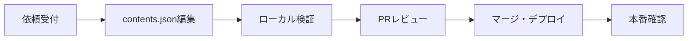

# E) 運用ルール

## 概要

チャットボットコンテンツの更新フロー、品質管理、将来拡張方針を定義する。

---

## 1. JSON更新フロー

### 現在のフロー（エンジニアのみ）



### ステップ詳細

#### 1. 依頼受付
- Slackチャンネル `#chatbot-content-request` で依頼を受付
- 依頼テンプレート:
  ```
  【種別】追加 / 更新 / 削除
  【対象画面】yield_personal, yield_company など
  【カテゴリ】faq / howto / glossary / error / general
  【タイトル】〇〇について
  【内容】回答本文
  【リンク】関連URL（任意）
  【優先度】高/中/低
  ```

#### 2. contents.json編集
- `chatbot/data/contents.json` を直接編集
- 命名規則:
  - `item_XXX`: 連番でID付与（例: `item_101`）
  - キーワードは最低3つ設定

#### 3. ローカル検証
```bash
# スキーマバリデーション
npm run chatbot:validate

# 開発サーバーで動作確認
npm run dev
```

#### 4. PRレビュー
- PRテンプレートを使用
- 必須レビュアー: チーム内1名以上
- チェック項目:
  - [ ] スキーマに準拠しているか
  - [ ] 画面IDが正しいか
  - [ ] キーワードが適切か
  - [ ] リンクが有効か

#### 5. マージ・デプロイ
- mainブランチへマージ
- CI/CDで自動デプロイ

#### 6. 本番確認
- 該当画面でチャットボットを開いて動作確認
- 検索でヒットするか確認

---

## 2. コンテンツ品質ガイドライン

### 文章スタイル

| 項目 | ルール |
|------|--------|
| 文体 | です・ます調 |
| 文長 | 1文50文字以内 |
| 箇条書き | 3項目以上は箇条書き |
| 専門用語 | 初出時に説明を付ける |

### 構成テンプレート

```markdown
【状況説明】〜の場合は、以下をご確認ください。

【対処手順】
1. 〇〇を確認
2. △△を実行
3. 上記で解決しない場合は□□

【関連リンク】
- 詳細ドキュメント: URL
```

### 禁止事項

- 曖昧な表現（「多分」「かもしれません」）
- 社外向けでない情報の記載
- 個人名の記載
- 有効期限が短い情報（キャンペーン等）

---

## 3. バリデーション

### スキーマバリデーション

```javascript
// scripts/validate-contents.js
const Ajv = require('ajv');
const schema = require('./contents-schema.json');
const contents = require('../data/contents.json');

const ajv = new Ajv();
const validate = ajv.compile(schema);

if (!validate(contents)) {
  console.error('Validation errors:', validate.errors);
  process.exit(1);
}

console.log('✓ contents.json is valid');
```

### 追加チェック

```javascript
// scripts/lint-contents.js

// 1. 重複IDチェック
const ids = Object.keys(contents.content_items);
const duplicates = ids.filter((id, i) => ids.indexOf(id) !== i);
if (duplicates.length > 0) {
  throw new Error(`Duplicate IDs: ${duplicates.join(', ')}`);
}

// 2. 不正なscreen_id参照チェック
const validScreens = Object.keys(contents.screen_registry);
Object.values(contents.content_items).forEach(item => {
  item.screens.forEach(s => {
    if (!validScreens.includes(s)) {
      throw new Error(`Invalid screen_id: ${s} in ${item.id}`);
    }
  });
});

// 3. 空キーワードチェック
Object.values(contents.content_items).forEach(item => {
  if (item.keywords.length === 0) {
    console.warn(`Warning: No keywords for ${item.id}`);
  }
});
```

---

## 4. ログ・分析

### 収集するログ

| イベント | データ | 用途 |
|---------|--------|------|
| session_start | session_id, screen_id, timestamp | 利用画面分析 |
| option_click | session_id, state_id, target | 導線分析 |
| content_view | session_id, item_id | 人気コンテンツ |
| search_query | session_id, query, result_count | 検索ニーズ |
| search_no_result | session_id, query | 不足コンテンツ発見 |

### ログ形式

```json
{
  "event": "content_view",
  "timestamp": "2026-01-30T18:30:00+09:00",
  "session_id": "550e8400-e29b-41d4-a716-446655440000",
  "screen_id": "yield_personal",
  "data": {
    "item_id": "item_001"
  }
}
```

### 分析指標（KPI）

| 指標 | 目標 | 測定方法 |
|------|------|----------|
| 解決率 | 80%以上 | コンテンツ閲覧後に「問い合わせ」を押さない割合 |
| 検索ヒット率 | 70%以上 | 検索結果0件以外の割合 |
| 平均ステップ数 | 3以下 | 開始から解決までの遷移回数 |
| 利用率 | 月間アクティブユーザーの10%以上 | 月間セッション開始数 / MAU |

### 月次レポート

```markdown
# チャットボット月次レポート - 2026年1月

## サマリー
- 総セッション数: 1,234
- 解決率: 82%
- 検索ヒット率: 75%

## 画面別利用状況
| 画面 | セッション数 | 解決率 |
|------|------------|--------|
| yield_personal | 456 | 85% |
| settings_main | 234 | 78% |

## 人気コンテンツ Top5
1. 歩留まりとは？ (item_001) - 234views
2. グラフが表示されない (item_002) - 189views
...

## 検索結果0件キーワード Top5
1. 「エクスポート」 - 45件 → 要コンテンツ追加
2. 「CSV」 - 32件 → 要コンテンツ追加
...

## 次月アクション
- [ ] エクスポート関連のFAQを追加
- [ ] CSVダウンロードの使い方を追加
```

---

## 5. 将来の管理画面拡張方針

### フェーズ計画

| フェーズ | 期間 | 内容 |
|---------|------|------|
| Phase 0 | 現在 | JSON直書き（エンジニアのみ） |
| Phase 1 | 3ヶ月後 | 簡易編集UI（CRUD画面） |
| Phase 2 | 6ヶ月後 | プレビュー機能、ドラフト/公開管理 |
| Phase 3 | 12ヶ月後 | 権限管理、複数言語対応 |

### アーキテクチャ拡張

```
Phase 0 (現在):
  Frontend → API → JSON File

Phase 1:
  Frontend → API → Content Repository Interface
                      ↓
                   JSON Repository (実装)

Phase 2+:
  Frontend → API → Content Repository Interface
                      ↓
                   Database Repository (新実装)
```

### Repository Interface

```typescript
// 将来の差し替えに備えた抽象化
interface ContentRepository {
  // 読み取り
  getScreenRegistry(): Promise<Record<string, ScreenDefinition>>;
  getContentItems(screenId?: string): Promise<ContentItem[]>;
  getContentById(id: string): Promise<ContentItem | null>;
  searchContents(query: string, screenId?: string): Promise<ContentItem[]>;
  
  // 書き込み（Phase 1以降）
  createContent(item: ContentItem): Promise<ContentItem>;
  updateContent(id: string, item: Partial<ContentItem>): Promise<ContentItem>;
  deleteContent(id: string): Promise<void>;
}

// 現在の実装
class JsonFileRepository implements ContentRepository {
  private contents: ContentsJson;
  
  constructor(filePath: string) {
    this.contents = JSON.parse(fs.readFileSync(filePath, 'utf-8'));
  }
  
  // ... 実装
}

// 将来の実装
class DatabaseRepository implements ContentRepository {
  constructor(private db: Database) {}
  
  // ... 実装
}
```

---

## 6. 障害対応

### 障害レベル

| レベル | 状況 | 対応 |
|--------|------|------|
| L1 | チャットボット表示不可 | 緊急対応（1時間以内） |
| L2 | 一部機能不全 | 当日対応 |
| L3 | 軽微な表示崩れ | 次回リリースで対応 |

### ロールバック手順

```bash
# 1. 直前のコミットに戻す
git revert HEAD

# 2. 緊急デプロイ
npm run deploy:emergency

# 3. 確認
curl https://app.example.com/api/v1/chat/start -X POST -d '{"screen_id":"yield_personal"}'
```

### 連絡先

| 役割 | 担当 | 連絡先 |
|------|------|--------|
| 技術担当 | エンジニアチーム | #chatbot-dev |
| コンテンツ担当 | CSチーム | #chatbot-content |
| 緊急連絡 | オンコール | PagerDuty |

---

## TODO / 仮置き事項

- [ ] Slackチャンネル作成
- [ ] PRテンプレート作成
- [ ] ログ収集基盤の選定（BigQuery / Elasticsearch等）
- [ ] 月次レポート自動生成スクリプト
