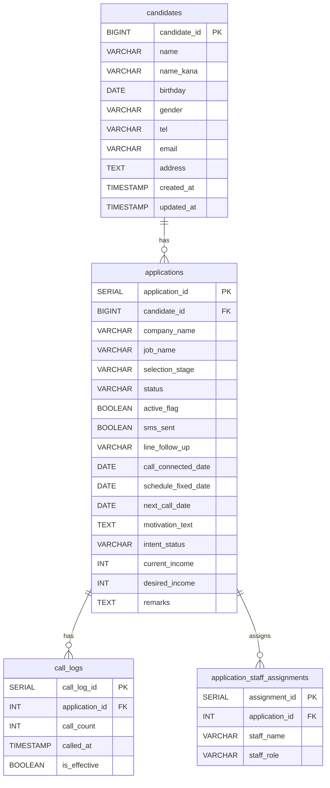
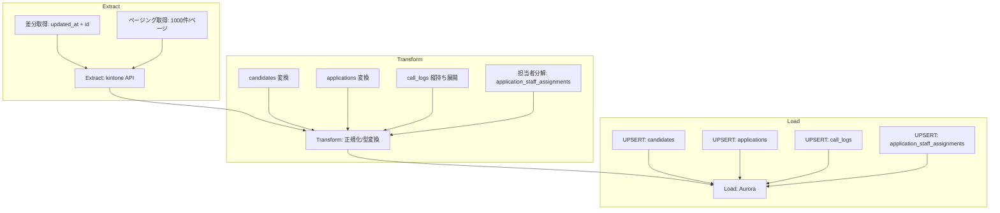

# kintone -> Aurora データベース設計書

## ER 図

## テーブル定義

### candidates (求職者マスタ)

| カラム名 | データ型 | kintone項目名 | 備考 |
| --- | --- | --- | --- |
| candidate_id | BIGINT (PK) | 求職者コード | ユニークなID |
| name | VARCHAR(255) | 求職者名 |  |
| name_kana | VARCHAR(255) | 求職者名（カタカナ） |  |
| birthday | DATE | 生年月日 |  |
| gender | VARCHAR(10) | 性別 | ラジオボタン |
| tel | VARCHAR(20) | 電話番号 |  |
| email | VARCHAR(255) | メールアドレス |  |
| address | TEXT | 現住所 |  |
| created_at | TIMESTAMP | 登録日 |  |
| updated_at | TIMESTAMP | 更新日時 |  |

### applications (選考・案件管理)

| カラム名 | データ型 | kintone項目名 | 備考 |
| --- | --- | --- | --- |
| application_id | SERIAL (PK) | - | 内部管理ID |
| candidate_id | BIGINT (FK) | 求職者コード | candidatesテーブルと紐付け |
| company_name | VARCHAR(255) | 応募企業名 |  |
| job_name | VARCHAR(255) | 応募求人名 |  |
| selection_stage | VARCHAR(50) | 応募段階 | ドロップダウン |
| status | VARCHAR(50) | ステータス | ドロップダウン |
| active_flag | BOOLEAN | アクティブ | チェックボックス |
| sms_sent | BOOLEAN | SMS送信 | ラジオボタン |
| line_follow_up | VARCHAR(100) | LINE追客 |  |
| call_connected_date | DATE | 通電日 |  |
| schedule_fixed_date | DATE | 日程確定日 |  |
| next_call_date | DATE | 新規発信予定日 |  |
| motivation_text | TEXT | 動機文 |  |
| intent_status | VARCHAR(50) | 意欲ステータス |  |
| current_income | INT | 年収（現） |  |
| desired_income | INT | 年収（希望） |  |
| remarks | TEXT | 備考 |  |

### call_logs (架電履歴)

| カラム名 | データ型 | kintone項目名 | 備考 |
| --- | --- | --- | --- |
| call_log_id | SERIAL (PK) | - |  |
| application_id | INT (FK) | - | applicationsテーブルと紐付け |
| call_count | INT | - | 何回目の架電か(1〜10) |
| called_at | TIMESTAMP | ◯回目架電 | 架電日時 |
| is_effective | BOOLEAN | 有効応募/通電 | ラジオボタンの結果 |

### application_staff_assignments (担当者紐付け)

| カラム名 | データ型 | 備考 |
| --- | --- | --- |
| assignment_id | SERIAL (PK) |  |
| application_id | INT (FK) | applicationsテーブルと紐付け |
| staff_name | VARCHAR(255) | 担当者名（田中莉子など） |
| staff_role | VARCHAR(50) | CS / パートナー の種別 |

## ETL 設計

## 設計のポイント

- 正規化: call_logs と application_staff_assignments を分離し分析性を向上
- ユーザー選択: 中間テーブルで多対多を表現
- 履歴データ: remarks は TEXT で保持し、必要に応じて notes テーブル化
