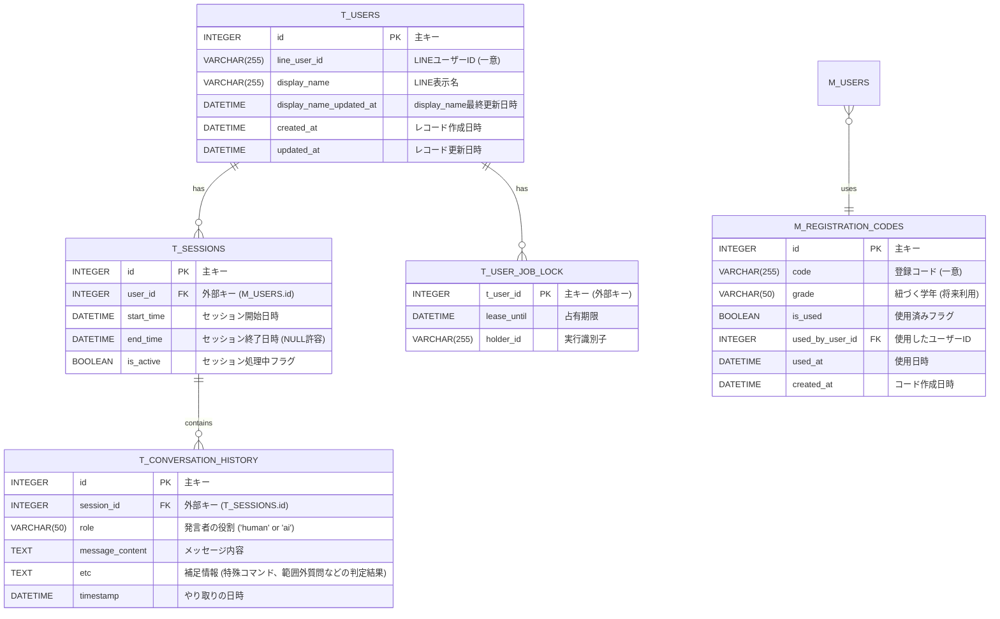
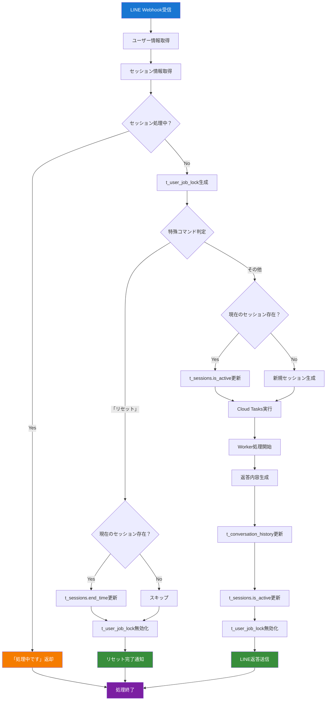
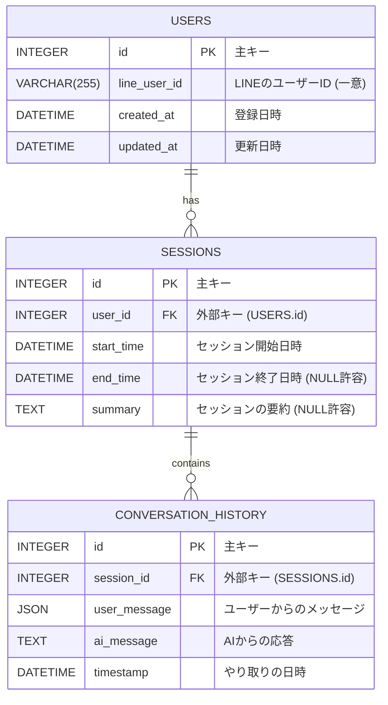

# データベース設計書 (作成中！！！！！)

このドキュメントは、アプリケーションの永続化層に関する技術選定の経緯と、具体的なデータベース設計を定義します。

## 1. 永続化層の技術選定

アプリケーションの会話履歴などを永続化するため、本プロジェクトではリレーショナルデータベース（SQL）を採用します。

### 開発フロー

1.  **初期開発フェーズ**: 開発効率を考慮し、ローカル環境に構築した**PostgreSQL**をデータベースとして利用します。
2.  **本番展開フェーズ**: アプリケーションをGCPにデプロイする際、データベースを**Cloud SQL for PostgreSQL**に移行します。

PythonのORM（Object-Relational Mapper）であるSQLAlchemyを利用することで、コードの大部分を変更することなく、接続情報（データベースURL）の切り替えだけでこの移行を実現できます。

---

## 2. SQLデータベース設計

### 2.1. ER図 (最新)

現在のアプリケーションで採用されている設計です。
会話の各発言（ユーザーから、AIから）を個別のレコードとして記録する柔軟な構造になっています。

### 2.2. テーブル定義 (最新)

#### `t_users` テーブル

LINEユーザーの情報を管理します。

| カラム名 | 型 | 説明 | 制約 |
| :--- | :--- | :--- | :--- |
| `id` | `INTEGER` | 主キー | PRIMARY KEY, AUTO_INCREMENT |
| `line_user_id` | `VARCHAR(255)` | LINEから提供される一意のユーザーID | NOT NULL, UNIQUE |
| `display_name` | `VARCHAR(255)` | LINEの表示名。初回登録時にAPIから取得 | |
| `display_name_updated_at` | `DATETIME` | display_nameが最後に更新された日時 | |
| `created_at` | `DATETIME` | レコードが最初に作成された日時 | NOT NULL, DEFAULT NOW() |
| `updated_at` | `DATETIME` | レコードが更新された日時 | NOT NULL, DEFAULT NOW() ON UPDATE NOW() |

#### `t_sessions` テーブル

ユーザーとの一連のやり取り（セッション）を管理します。

| カラム名 | 型 | 説明 | 制約 |
| :--- | :--- | :--- | :--- |
| `id` | `INTEGER` | 主キー | PRIMARY KEY, AUTO_INCREMENT |
| `t_user_id` | `INTEGER` | `t_users`テーブルへの外部キー | NOT NULL, FOREIGN KEY (`t_users`.`id`) |
| `start_time` | `DATETIME` | セッションの開始日時 | NOT NULL |
| `end_time` | `DATETIME` | セッションの終了日時。アクティブなセッションはNULL。 | |
| `is_active` | `BOOLEAN` | セッションが現在処理中かどうかのフラグ | NOT NULL, DEFAULT TRUE |

#### `t_conversation_history` テーブル

セッション内の具体的な会話履歴を、発言単位で保存します。

| カラム名 | 型 | 説明 | 制約 |
| :--- | :--- | :--- | :--- |
| `id` | `INTEGER` | 主キー | PRIMARY KEY, AUTO_INCREMENT |
| `t_session_id` | `INTEGER` | `t_sessions`テーブルへの外部キー | NOT NULL, FOREIGN KEY (`t_sessions`.`id`) |
| `role` | `VARCHAR(50)` | 発言者の役割。`'human'`または`'ai'`。 | NOT NULL |
| `message_content` | `TEXT` | メッセージの内容。 | NOT NULL |
| `etc` | `TEXT` | 補足情報（特殊コマンド、範囲外質問などの判定結果） | |
| `timestamp` | `DATETIME` | やり取りが発生した日時。 | NOT NULL, DEFAULT CURRENT_TIMESTAMP |

#### `t_user_job_lock` テーブル

同時実行制御のための監視用テーブルです。ユーザー単位での処理の排他制御を行います。

| カラム名 | 型 | 説明 | 制約 |
| :--- | :--- | :--- | :--- |
| `t_user_id` | `INTEGER` | 主キー（外部キー） | PRIMARY KEY, FOREIGN KEY (`t_users`.`id`) |
| `lease_until` | `DATETIME` | 占有期限。DB の NOW() 基準 | NOT NULL |
| `holder_id` | `VARCHAR(255)` | 実行識別子（例：リクエストID） | NOT NULL |

#### `m_registration_codes` テーブル

ユーザー登録時に使用する登録コードを管理します。

| カラム名 | 型 | 説明 | 制約 |
| :--- | :--- | :--- | :--- |
| `id` | `INTEGER` | 主キー | PRIMARY KEY, AUTO_INCREMENT |
| `code` | `VARCHAR(255)` | ユニークな登録コード | NOT NULL, UNIQUE |
| `grade` | `VARCHAR(50)` | （将来利用）このコードに紐づく学年情報 | |
| `is_used` | `BOOLEAN` | 使用済みかを示すフラグ | NOT NULL, DEFAULT FALSE |
| `created_at` | `DATETIME` | このコードが作成された日時 | NOT NULL, DEFAULT NOW() |
| `used_at` | `DATETIME` | このコードが使用された日時 | |
| `used_by_user_id` | `INTEGER` | このコードを使用した`m_users`テーブルのID | FOREIGN KEY (`m_users`.`id`) |

---

## 3. データベース処理フロー

LINEからのWebhook通信から返答生成までのデータベース処理の流れを以下に示します。

### 処理フロー詳細

#### 1. 初期処理
- LINE Webhookからユーザー情報とセッション情報を取得
- セッションの処理状態を確認

#### 2. 排他制御チェック
- `t_user_job_lock`テーブルで有効なロックが存在するかチェック
- `t_sessions.is_active`が`true`のセッションが存在するかチェック
- いずれかが該当する場合は「処理中です」メッセージを返却して終了

#### 3. 特殊コマンド処理（「リセット」）
- 新しい`t_user_job_lock`を生成
- 既存のアクティブセッションがあれば`end_time`を更新
- ロックを無効化してリセット完了を通知

#### 4. 通常処理
- 新しい`t_user_job_lock`を生成
- 既存セッションの`is_active`を更新、または新規セッションを生成
- Cloud Tasksでワーカープロセスを実行

#### 5. ワーカー処理
- AI返答を生成
- `t_conversation_history`に会話履歴を記録
- セッションの`is_active`を更新
- ロックを無効化
- LINEに返答を送信

---

## 4. 旧設計案 (参考)

開発初期に検討された設計案です。ユーザーとAIの1往復のやり取りを1つのレコードとして記録する方式です。

### 3.1. ER図 (旧)

### 3.2. テーブル定義 (旧)

#### `conversation_history` テーブル (旧)

セッション内の具体的な会話履歴を、**1往復単位で**保存します。

| カラム名       | 型           | 説明                                                                                             | 制約                                      |
| :------------- | :----------- | :----------------------------------------------------------------------------------------------- | :---------------------------------------- |
| `id`           | `INTEGER`    | 主キー                                                                                           | PRIMARY KEY, AUTO_INCREMENT               |
| `session_id`   | `INTEGER`    | `sessions`テーブルへの外部キー                                                                   | NOT NULL, FOREIGN KEY (`sessions`.`id`)   |
| `user_message` | `TEXT`/`JSON`  | ユーザーからのメッセージ。テキスト、または画像情報(`{"type": "image", "original_content_url": "..."}`)などを格納。 | NOT NULL                                  |
| `ai_message`   | `TEXT`       | AIからの応答メッセージ。                                                                         | NOT NULL                                  |
| `timestamp`    | `DATETIME`   | やり取りが発生した日時。                                                                         | NOT NULL, DEFAULT CURRENT_TIMESTAMP       |

---