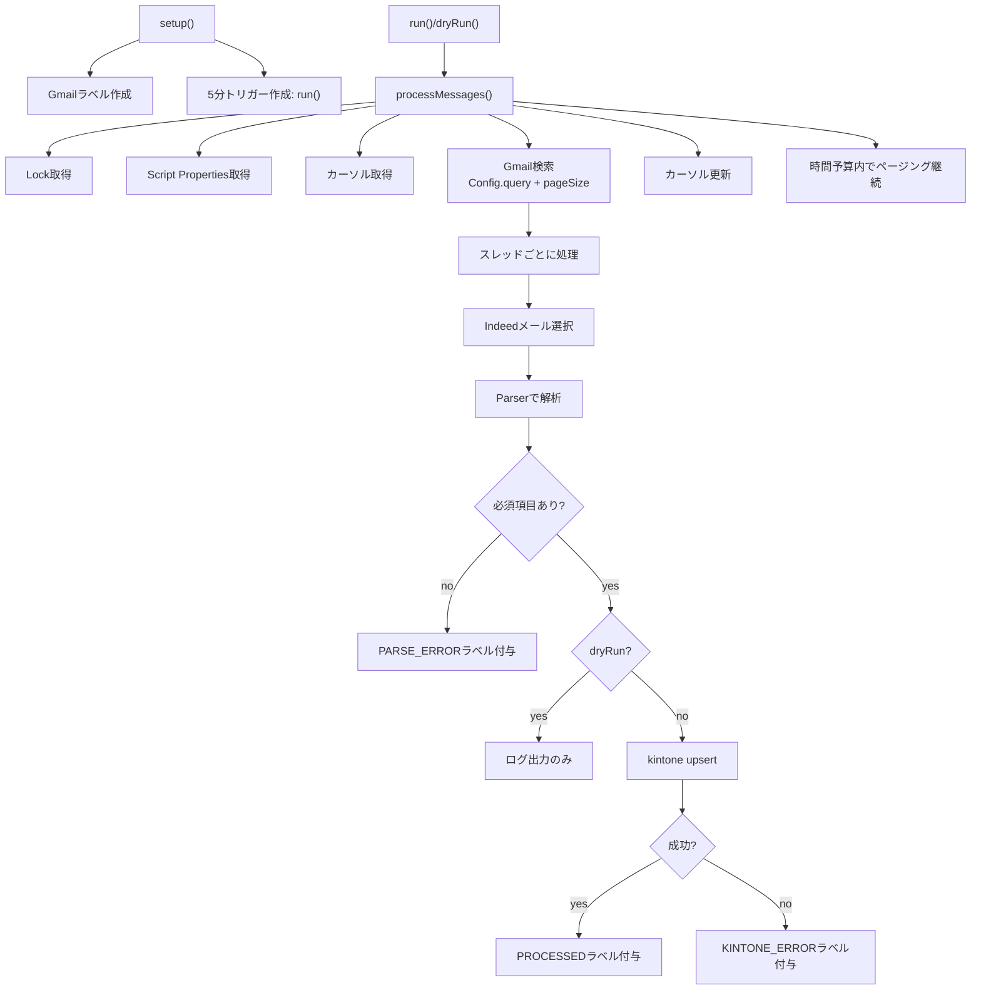

# システム概要（Indeed → kintone 転記）

```mermaid
flowchart TD
  A["setup()"] --> B["Gmailラベル作成"]
  A --> C["5分トリガー作成: run()"]

  D["run()/dryRun()"] --> E["processMessages()"]
  E --> F["Lock取得"]
  E --> G["Script Properties取得"]
  E --> H["カーソル取得"]

  E --> I["Gmail検索<br/>Config.query + pageSize"]
  I --> J["スレッドごとに処理"]
  J --> K["Indeedメール選択"]
  K --> L["Parserで解析"]
  L --> M{"必須項目あり?"}
  M -- no --> N["PARSE_ERRORラベル付与"]
  M -- yes --> O{"dryRun?"}
  O -- yes --> P["ログ出力のみ"]
  O -- no --> Q["kintone upsert"]
  Q --> R{"成功?"}
  R -- yes --> S["PROCESSEDラベル付与"]
  R -- no --> T["KINTONE_ERRORラベル付与"]

  E --> U["カーソル更新"]
  E --> V["時間予算内でページング継続"]
```
